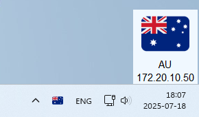
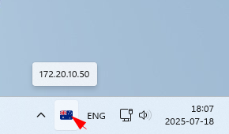
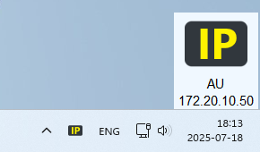
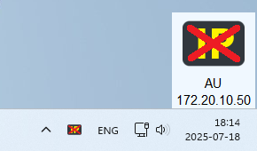

# MyIP-Tray

The project is a fork of [My-IP-Widget](https://github.com/B3H1Z/My-IP-Widget)
originally designed by [Behnam Ahmadi](https://behnamahmadi.com/) aka "B3H1Z".

It is aimed to observe and verify your public (external, WAN) IP address in realtime.

## Usage

### Working modes

To switch between working modes click on application icon in system tray.

#### Visible mode

Normal working mode when application window is visible.



#### Minimized mode

Working mode when application window is minimized.



## Installation

- Go to [Releases](https://github.com/rpanchyk/myip-tray/releases) page.
- Open the lastest release and download "myip-tray-windows.zip" file.
- Extract archive to any folder on your PC.

## Configuration

Change `.env` configuration file according to your needs:

```dotenv
RUN_ON_BOOT=false
START_MINIMIZED=false
SHOW_ON_TOP=true
POSITION_ABSOLUTE=false
POSITION_X=0
POSITION_Y=0
BACKGROUND_COLOR=aliceblue
FOREGROUND_COLOR=black
FONT_FAMILY=Arial
FONT_SIZE=11
REFRESH_INTERVAL_SECONDS=60
REFRESH_TIMEOUT_SECONDS=10
EXPECTED_IP=
```

Options:

- `RUN_ON_BOOT` - start application on system boot.
- `START_MINIMIZED` - hide application window on start up.
- `SHOW_ON_TOP` - show application window on top.
- `POSITION_ABSOLUTE` - where to place application window:
    - false to use previous position.
    - true for absolute position on screen relied on `POSITION_X` and `POSITION_Y` options.
- `BACKGROUND_COLOR` and `FOREGROUND_COLOR` - color of window and text respectively (
  See [available colors](https://www.plus2net.com/python/tkinter-colors.php)).
- `FONT_FAMILY` and `FONT_SIZE` - font name and size of text.
- `REFRESH_INTERVAL_SECONDS` - period in seconds of IP address verification.
- `REFRESH_TIMEOUT_SECONDS` - timeout in seconds for outgoing request for obtaining IP address.
- `EXPECTED_IP` - the IP address to be expected (if set).

### Expected IP feature explanation

If you expect the specific IP should be used it is possible to set up it through configuration.
The country flag will be changed to static one indicating required IP is active or not.




To turn on this feature, just change `.env` configuration file, for example:

```dotenv
EXPECTED_IP=172.20.10.50
```

## Development

### Dependencies

Execute the command to add all required dependencies:

```shell
pip install -r requirements.txt pyinstaller
```

### Run

Execute the command to run application:

```shell
python main.py
```

### Build

Execute the command to create executable:

```shell
pyinstaller --clean --noconfirm --onefile --windowed --icon "./assets/icons/icon.ico" --add-data "./assets:assets" --name "myip-tray" main.py
```

# Disclaimer

The software is provided "as is", without warranty of any kind, express or
implied, including but not limited to the warranties of merchantability,
fitness for a particular purpose and noninfringement. in no event shall the
authors or copyright holders be liable for any claim, damages or other
liability, whether in an action of contract, tort or otherwise, arising from,
out of or in connection with the software or the use or other dealings in the
software.

# Contribution

If you have any ideas or inspiration for contributing the project,
please create an [issue](https://github.com/rpanchyk/myip-tray/issues/new)
or [pull request](https://github.com/rpanchyk/myip-tray/pulls).
